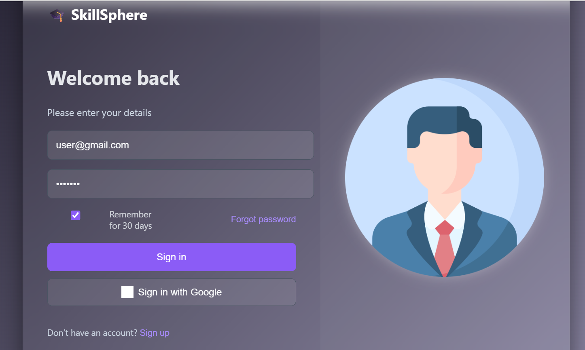
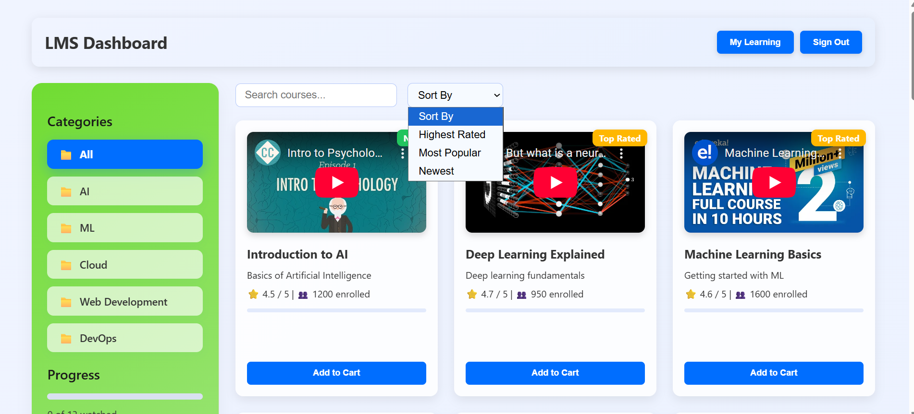
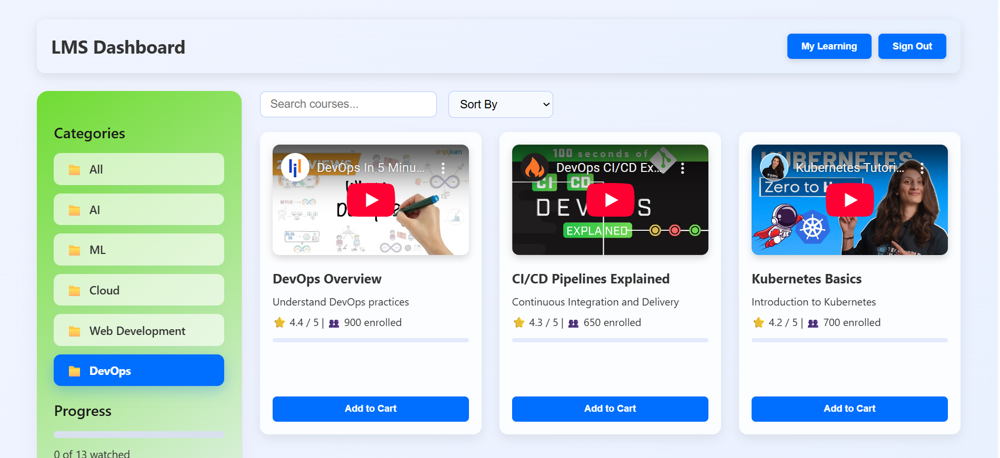
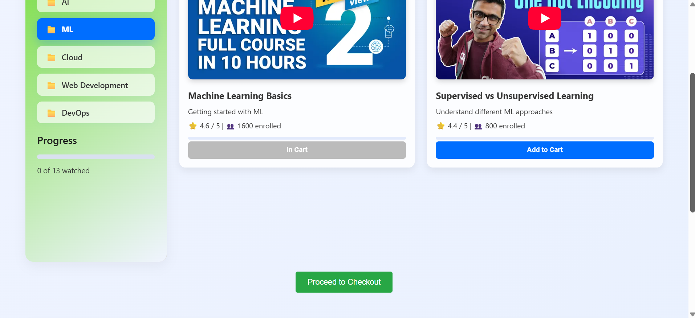
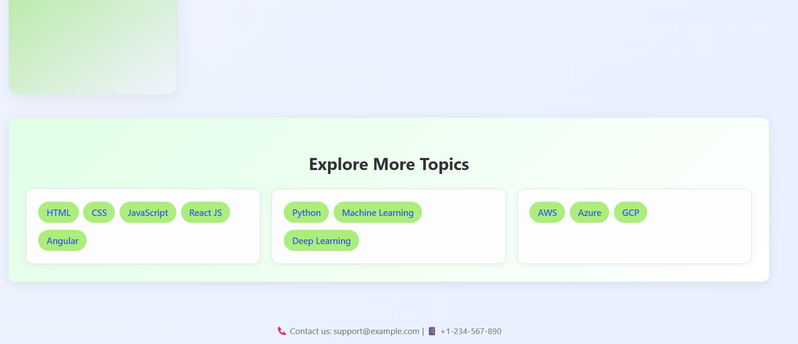

# 🎓 Learning Management System (MERN Stack)

A **full-stack Learning Management System (LMS)** built using the **MERN stack (MongoDB, Express, React, Node.js)**.
The platform allows users to browse courses, manage a cart, authenticate users, and access a dashboard.

---

# 🚀 Features

* User Authentication (Login system)
* Course Listing
* Course Cart Page
* User Dashboard
* RESTful API backend
* MongoDB database integration
* React-based frontend UI

---

# 🛠 Tech Stack

### Frontend

* React.js
* HTML5
* CSS3
* JavaScript (ES6)

### Backend

* Node.js
* Express.js

### Database

* MongoDB
* Mongoose

### Tools

* Git
* GitHub
* npm

---

# 📂 Project Structure

```
Learning-Management-System
│
│   .gitignore
│   package.json
│   package-lock.json
│
└── backend
    │   server.js
    │   package.json
    │   package-lock.json
    │
    ├── client                 # React Frontend
    │   │   package.json
    │   │   README.md
    │   │
    │   ├── public
    │   │   ├── index.html
    │   │   ├── favicon.ico
    │   │   ├── logo192.png
    │   │   ├── logo512.png
    │   │   ├── manifest.json
    │   │   └── robots.txt
    │   │
    │   └── src
    │       ├── App.js
    │       ├── index.js
    │       ├── Dashboard.js
    │       ├── CoursesPage.js
    │       ├── CartPage.js
    │       ├── LoginPage.js
    │       ├── Sidebar.js
    │       └── CSS files
    │
    ├── controllers            # Business logic
    │       courseController.js
    │
    ├── middleware             # Authentication middleware
    │       authMiddleware.js
    │
    ├── models                 # MongoDB models
    │       Course.js
    │       User.js
    │
    └── routes                 # API routes
            courseRoutes.js
            userRoutes.js
```

---

# ⚙️ Installation

### 1️⃣ Clone the Repository

```
git clone https://github.com/likhitha-019/Learning-Management-System.git
cd Learning-Management-System
```

---

### 2️⃣ Install Backend Dependencies

```
cd backend
npm install
```

---

### 3️⃣ Install Frontend Dependencies

```
cd client
npm install
```

---

# ▶️ Running the Project

### Start Backend Server

```
cd backend
node server.js
```

Backend runs on:

```
http://localhost:5000
```

---

### Start Frontend

```
cd backend/client
npm start
```

Frontend runs on:

```
http://localhost:3000
```

---

# 📡 API Endpoints

### User Routes

```
POST /api/users/login
POST /api/users/register
```

### Course Routes

```
GET /api/courses
POST /api/courses
```

---

# 📸 Application Screenshots

| Login Page | Course Dashboard |
|------------|------------------|
|  |  |

| Categories | Checkout |
|------------|----------|
|  |  |

| Explore More Topics |
|---------------------|
|  |

---

# 🔮 Future Improvements

* Course Enrollment
* Instructor Panel
* Payment Integration
* Video Lectures
* Assignment Submission
* Admin Dashboard

---

# 👩‍💻 Author

**Likhitha**

GitHub:
[https://github.com/likhitha-019](https://github.com/likhitha-019)

---

# 📄 License

This project is licensed under the **MIT License**.

---

✅ **Tip:**
Add **screenshots of Login, Courses, Dashboard** in README. Recruiters like that.

---

If you want, I can also give you a **🔥 much more impressive README (with badges, project preview images, and architecture diagram)** that makes your GitHub project look **professional for placements**.
